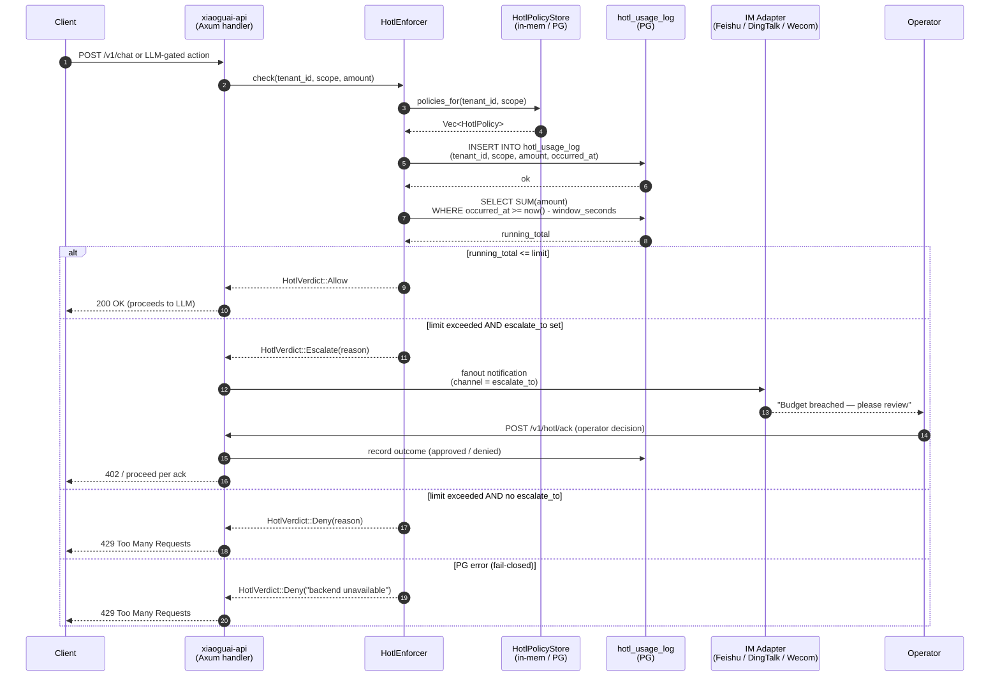

# HotL-Gated Request Flow

A HotL (Hard-Token-Limit) check wraps every LLM call and any other
budgeted action. The sequence below shows what happens from the moment a
client sends a request through the REST API until either the action
proceeds or an escalation notification fans out to the operator's IM
channel. The enforcer records usage **before** returning a verdict, so
concurrent callers always see an up-to-date counter; on `Deny` the
caller must abort regardless of its own local state.

## Related

- **ADR**: `docs/architecture/adr/0009-cost-quota-and-token-bomb-defense.md`
- **Source crates**:
  - Enforcer + policy types: `crates/xiaoguai-api/src/hotl/`
  - REST routes: `crates/xiaoguai-api/src/routes/hotl.rs`
  - PG bridge (v1.3): `crates/xiaoguai-core/src/hotl_bridge.rs` (planned)
- **Migration**: `migrations/0011_hotl_policies.sql`
