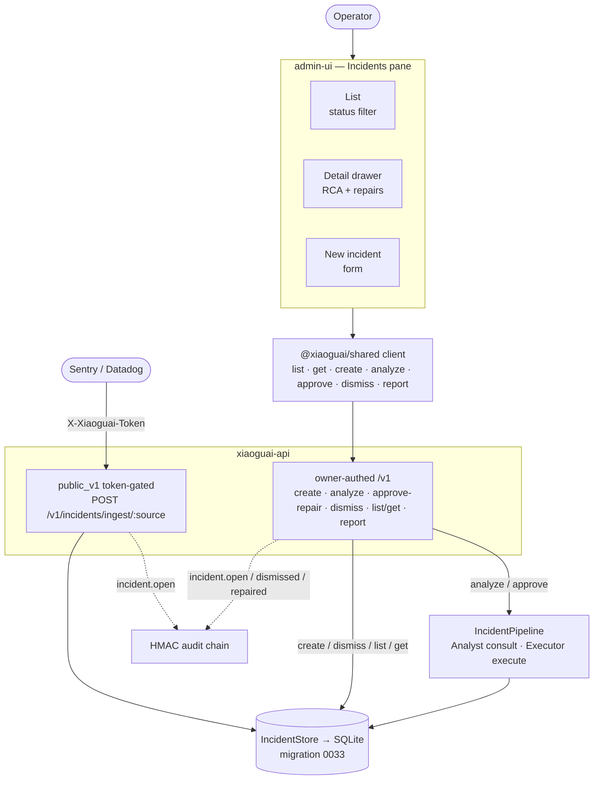
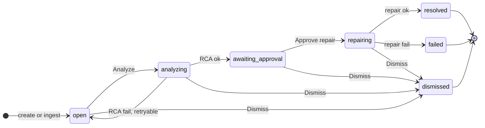
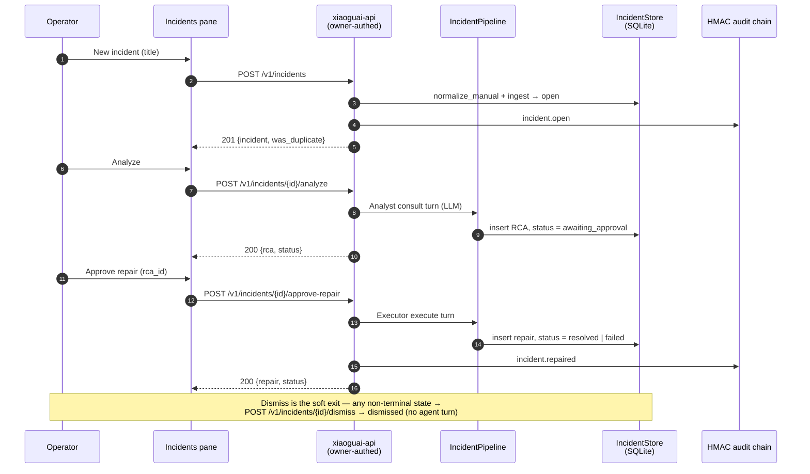

# Incident Self-Healing — Admin Pane Flow

The T6 self-healing backend (incident ingest → Analyst RCA → human-approved
Executor repair; capability wave #277, migration 0033) shipped REST + CLI only.
The **admin-ui Incidents pane** (PR for `feat/incidents-pane`, plan
[`docs/plans/2026-06-19-incidents-pane.md`](../../plans/2026-06-19-incidents-pane.md))
makes the human-in-the-loop approval gate operable from the browser.

Two trust boundaries meet here and must stay separate:

- **owner-authed `/v1`** — everything the pane drives (list/get, **create**,
  analyze, approve-repair, **dismiss**, report). The owner is already
  authenticated (DEC-033, single owner), so no extra token.
- **token-gated `public_v1`** — `POST /v1/incidents/ingest/{source}` for
  external observability platforms (Sentry/Datadog) that can't do HTTP Basic;
  guarded by `X-Xiaoguai-Token`. The pane never uses this path.

Manual create from the pane uses the **new owner-authed `POST /v1/incidents`**
(reuses `normalize_manual`), NOT the webhook — so a browser never holds a
long-lived webhook token, and both paths still produce identical rows via the
one `IncidentStore::ingest`.

## 1. Architecture — components & trust boundaries

## 2. Incident lifecycle — status machine + driving action

Each transition is gated by `IncidentStatus::can_transition_to`
(`crates/xiaoguai-api/src/incident_store/mod.rs`). Live states hold the
`(source, external_id)` dedup slot; `resolved` / `failed` / `dismissed` are
terminal and immutable. The label on each edge is the pane action / endpoint
that drives it.

- **Analyze** → `POST /v1/incidents/{id}/analyze` (Analyst consult turn; 409
  unless `open`; 502 on agent/RCA-contract failure → reverts to `open`).
- **Approve repair** → `POST /v1/incidents/{id}/approve-repair` with
  `{rca_id}` (the RCA the owner reviewed, #284); 409 on a stale `rca_id`.
- **Dismiss** → `POST /v1/incidents/{id}/dismiss` (any non-terminal →
  `dismissed`; 409 if already terminal).

## 3. Sequence — create → analyze → approve

## Related

- **HLD decision**: `xiaoguai-agent-design/docs/hld.md` → DEC-040 (incident admin pane).
- **Plan**: [`docs/plans/2026-06-19-incidents-pane.md`](../../plans/2026-06-19-incidents-pane.md)
- **Source**:
  - Routes: `crates/xiaoguai-api/src/routes/incidents.rs` (+ mount in `routes/mod.rs`)
  - Store + status machine: `crates/xiaoguai-api/src/incident_store/`
  - Pipeline: `crates/xiaoguai-api/src/incident_pipeline.rs`
  - Normalizer: `crates/xiaoguai-api/src/incidents.rs`
  - Pane: `frontend/admin-ui/src/panes/Incidents.tsx`; client `frontend/shared/src/index.ts`
- **User guide**: [`docs/user-guide/self-healing.md`](../../user-guide/self-healing.md)
- **Migration**: `crates/xiaoguai-storage/migrations/0033_incidents.sql`
