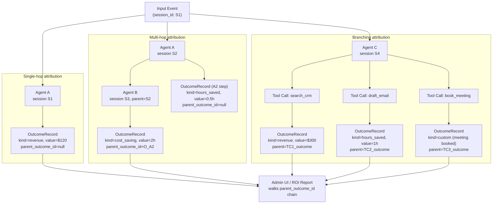

# Outcome Attribution Chain

Outcome telemetry lets any agent session claim credit for a measurable
business result — revenue, cost savings, hours reclaimed, etc. Each
`OutcomeRecord` carries an optional `parent_outcome_id` that forms a
directed acyclic graph. A reader walks the chain from a leaf node back
to the root input event to reconstruct the full attribution path. The
diagram covers three shapes: single-hop (agent → outcome), multi-hop
(agent A → agent B → outcome), and branching (one agent spawning
multiple tool calls, each with its own attributed outcome).

## Related

- **ADR**: `docs/architecture/adr/0008-tool-result-provenance.md`
- **Source crates**:
  - Outcome types + in-memory recorder: `crates/xiaoguai-audit/src/outcomes.rs`
  - REST API surface: `crates/xiaoguai-api/src/outcomes.rs`
  - Routes: `crates/xiaoguai-api/src/routes/outcomes.rs`
  - PG bridge (v1.3): `crates/xiaoguai-core/src/outcomes_bridge.rs` (planned)
- **Migration**: `migrations/0012_outcomes.sql`
