# Skill Pack Install Lifecycle

A skill pack moves from the static catalog (baked into the binary as
`catalog/skill_packs.json`) through an install request, a database row
in `installed_skill_packs`, and — in v1.3 — dynamic loader activation
that makes the pack's tools live in the agent's Toolbox. In v1.2 the
activation step is a **no-op**: the row is recorded, the REST API
returns 201, but the pack runtime loader is not yet wired; routes
return 503 in production until the `Pg*` bridges land in v1.3.

```mermaid
stateDiagram-v2
    [*] --> Available : pack listed in catalog/skill_packs.json<br/>(compiled into binary)

    Available --> InstallRequested : POST /v1/skills/install<br/>{tenant_id, pack_id, knobs}

    InstallRequested --> RecordedInDB : INSERT INTO installed_skill_packs\n(id, tenant_id, pack_id, knobs, installed_at)

    RecordedInDB --> LoaderActivation : [v1.3 future]\nPgSkillPackRepository wired;\nruntime loader notified

    note right of RecordedInDB
        v1.2 "no-op activation" caveat:
        Row is persisted and GET /v1/skills/installed
        returns it, but pack tools are NOT loaded
        into the agent Toolbox. Pack loader
        (crates/xiaoguai-core/src/packs.rs,
        feature-gated) is not yet wired.
        Production routes return 503.
    end note

    LoaderActivation --> Live : Pack tools available\nin agent Toolbox

    Live --> UninstallRequested : DELETE /v1/skills/install/:id

    UninstallRequested --> Archived : soft-delete row\n(deleted_at set, tools removed\nfrom Toolbox on next reload)

    Archived --> [*]

    Available --> [*] : pack removed from catalog\n(binary update required)
```

## Related

- **ADR**: `docs/architecture/adr/0006-mcp-tasks-primitive.md`
- **Source crates**:
  - Catalog types + REST handlers: `crates/xiaoguai-api/src/skills.rs`
  - Pack activation stub: `crates/xiaoguai-core/src/packs.rs`
  - PG bridge (v1.3 planned): `crates/xiaoguai-core/src/skill_pack_bridge.rs`
- **Migration**: `migrations/0015_skill_packs.sql`
- **Catalog source**: `catalog/skill_packs.json`
