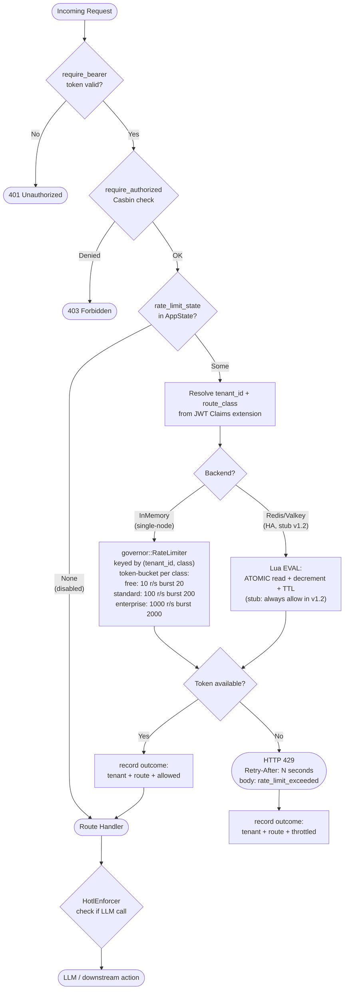

# Rate-Limit Decision Path

Every authenticated API request passes through the rate-limit middleware
before reaching any handler. The middleware resolves a `(tenant_id,
rate_class)` key, consults either the in-memory token bucket (single
node, powered by the `governor` crate) or the Valkey/Redis Lua EVAL
script (multi-node HA, currently a stub), and either allows the request
or returns HTTP 429 with a `Retry-After` header. A throttled request
never reaches the HotL budget enforcer. When `AppState.rate_limit_state`
is `None` the middleware is not mounted and all requests pass through.

## Related

- **ADR**: `docs/architecture/adr/0009-cost-quota-and-token-bomb-defense.md`
  (rate-limit and HotL are complementary; rate-limit runs first)
- **Source crates**:
  - Middleware + backends: `crates/xiaoguai-api/src/rate_limit.rs`
  - AppState wiring: `crates/xiaoguai-api/src/state.rs`
  - Auth Claims: `crates/xiaoguai-api/src/auth.rs`
- **Migration**: `migrations/0014_rate_limit_class.sql` (adds
  `tenants.rate_limit_class` column)
