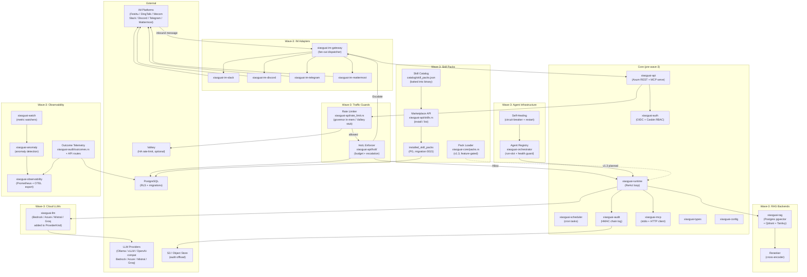

# Wave-3 System Overview

This C4-style component diagram shows all subsystems introduced in wave
3 and how they connect to the pre-existing core. Wave-3 added rate
limiting, HotL budget enforcement, outcome telemetry, the skill pack
marketplace, the agent registry, self-healing, watch/anomaly monitoring,
four new IM adapters (Discord, Telegram, Mattermost, Slack), three RAG
backends, cloud LLM providers (Bedrock, Azure, Mistral, Groq), and
audit-log S3 offload. Each subsystem is annotated with the crate or
module that implements it.

## Related

- **Design doc**: `docs/architecture/2026-05-21-design.md`
- **Wave-3 handoff**: `docs/HANDOFF-2026-05-26.md`
- **ADRs**:
  - `adr/0001-rust-toolchain.md`
  - `adr/0006-mcp-tasks-primitive.md`
  - `adr/0008-tool-result-provenance.md`
  - `adr/0009-cost-quota-and-token-bomb-defense.md`
  - `adr/0013-zero-default-telemetry.md`
- **All wave-3 crates**: `crates/xiaoguai-watch`, `xiaoguai-anomaly`,
  `xiaoguai-observability`, `xiaoguai-im-discord`, `xiaoguai-im-telegram`,
  `xiaoguai-im-mattermost`, `xiaoguai-im-slack`
